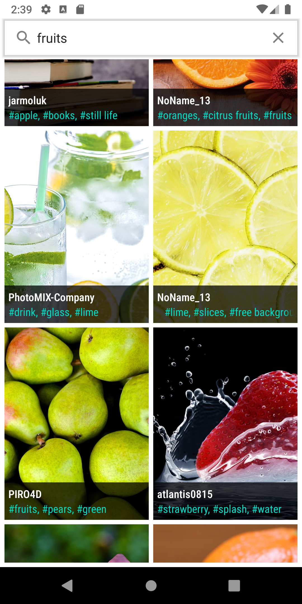

# Images

This repo is created to display the list of image and details of each image.

Build System : [Gradle](https://gradle.org/)

## Table of Contents

- [Prerequisite](#prerequisite)
- [App](#app)
- [Architecture](#architecture)
- [Testing](#testing)
- [Libraries](#libraries)
- [Screenshots](#screenshots)

## Prerequisite

This project uses the Gradle build system. To build this project.clone the repo and open in Android Studio.

## App
The App display the images which is fetched by the Pixabay Api. This app will work in offline mode 
because Room DB is used for local cache.
When the Image clicked, the detail of Image view will be shown.

## Architecture
MVVM Architecture
Jetpack compose
app is based on one activity with multiple fragment approach, 
Fragment -> ViewModel -> usecase -> repo to fetch data from server

## Testing
This app is testing the Fragment with the use of espresso

## Libraries

Libraries used in the whole application are:

- [Jetpack](https://developer.android.com/jetpack)🚀
    - [Viewmodel](https://developer.android.com/topic/libraries/architecture/viewmodel) - Manage UI
      related data in a lifecycle conscious way
    - [Data Binding](https://developer.android.com/topic/libraries/data-binding) - support library
      that allows binding of UI components in layouts to data sources, binds search results to UI
    - [Room](https://developer.android.com/training/data-storage/room) - Provides abstraction layer
      over SQLite used for cache
    - [Paging 3](https://developer.android.com/topic/libraries/architecture/paging/v3-overview) used
      for paging
- [Retrofit](https://square.github.io/retrofit/) - Type-safe HTTP client and supports coroutines out
  of the box. Used for the network calls.
- [Gson](https://github.com/google/gson) - Used to convert JSON to Java/Kotlin classes for the
  Retrofit
- [okhttp-logging-interceptor](https://github.com/square/okhttp/blob/master/okhttp-logging-interceptor/README.md)
    - logs HTTP request and response data.
- [kotlinx.coroutines](https://github.com/Kotlin/kotlinx.coroutines) - Library Support for
  coroutines
- [Hilt](https://developer.android.com/training/dependency-injection/hilt-android) - Used for
  Dependency injection
- [Glide](https://github.com/bumptech/glide) - Allows for fetching and displaying of images to
  imageviews

## Screenshots

||
|:----:|

||
|:----:|

## pending 

- Create Dialog
- Unit tests